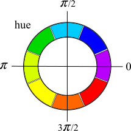

# Log-polar Images
One unexpected characteristic of vertebrate vision (and in particular of the human eye) is that, unlike the pixels in a photograph, the visual cells on the surface of the retina increase in size roughly in proportion to the distance from the center of sharpest vision at the fovea.

You might notice that from your own experience; if you gaze at a particular small region, say at this comma "," points distant from the comma can only be seen clearly when you shift your gaze to them. When your gaze is fixed on the comma your vision is progressively less distinct the more distant a point is from your gaze point.

It might seem that this progression of cell sizes from center to edge of the retina is just a consequence of resource sharing over a necessarily limited number of vision cells; cells are made smaller at the center where acute vision is needed at the sacrifice of larger cells at the edges of the retina. That might, indeed, be one reason. However, the property of image cell size increasing in proportion to distance from a fixed point, actually defines a specific image mapping known as a [log-polar][1] image. The image at the top is an example of a log-polar image that has been rendered back to a standard image by placing the "tiles" of the log-polar image directly over the locations where the tiles were constructed in the original image. 

It's evident that each tile is just a color point that was generated by averaging pixels in a small square region in the original image. Each generated color point was added to the one-dimensional log-polar image array that was scanned over the tight [log-spiral][2] path that is easily seen in the image. This particular log-polar image is a single array consisting of a sequence of about 30,000 color points with 96 array points per revolution of the spiral.

In the region of the standard image covered by the rendered log-polar image there were about 5,000,000 pixels. For that reason the image resolution of the log-polar image is very high at its geometric center where the square tiles are actually smaller than a single pixel in the standard image. These pixels can be seen in the right hand image below where progressive scaling by 5x was accomplished simply by starting the rendering at three different offsets into the log-polar image array.

_Because the scale of a log-polar image can be changed by setting the array offset, log-polar images of the same object captured at different scales can be compared at the same scale just by adjusting array offsets_.

#### The log-polar image at the top scaled successively just by setting successive offsets into the log-polar image array.

Log-polar images clearly have unexpected characteristics. This document will describe an implementation of log-polar vision based on a new machine vision library (LPXVision). To a limited extent, the log-polar approach mimics vertebrate vision. But the design decisions that were made in the implementation were based solely on what worked best in a practical machine vision system.

Nevertheless, it was soon discovered that log-polar images have such significant advantages over standard images that it is difficult to ignore the possibility that progressively increasing visual cell size away from the fovea in the vertebrate eye is nature's approximation to a log-polar mapping that confers the same sensory advantages to an organism.

# Log-polar Advantages
Machine vision that provides sensory capability to a self-directed autonomous machine is currently of great interest. All known machine vision systems directly process standard rectangular format images. In fact, most engineers are unaware that any other image format exists. Nevertheless, it is easy to demonstrate that log-polar images not only provide an alternative image format but also have inherent characteristics that match the requirements of autonomous vision much better than do standard images. 

These inherent characteristics not only reduce computing time but also provide sensory advantages that cannot be easily obtained from standard images. For these reasons, log-polar imaging provides the architecture for a new generation of embedded machine vision. Consider the following:

**Object recognition is a natural property of the log-polar format**. For images to be recognized, comparisons must somehow be made between images that have different visual sizes. But as we saw above, log-polar images are scaled just by changing the offset into the log-polar image array. Thus, log-polar images can be directly compared (and images recognized) just by progressively changing the offset into the log-polar image array until similarity to a reference image is either confirmed or denied.

**Log-polar images encode a two-dimension image into a _scale-invariant_ one-dimensional array.** Currently, image recognition and classification is usually done with a convolutional neural network in which the image information is extracted with a 2D convolution kernel. The kernel is scanned in both dimensions over the region of interest in the image. The size and stride of the convolution kernel might need to be adjusted if the number of pixels occupied by the target object is very small or very large.

The equivalent operation on a log-polar image uses a 1D convolution kernel consisting of a fixed length window which never needs to be resized because the target object at any scale will always fill exactly the same number of log-polar image cells in exactly the same way; when image scale is the only difference between image objects there is a one-to-one correspondence between the reference and target log-polar image cells at some offset into the target image array.

**Log-polar peripheral vision inherently provides orientation, navigation and recognition of familiar environments**. Because log-polar visual cells are large at the outer edges of the visual field, log-polar images from a wide-angle camera that are limited to that region record and respond only to large-scale visual characteristics of the environment. For that reason these images will later compare accurately with log-polar images from the same environment or a similar environment when viewed from the same visual orientation even if central details of the environment are different.

Moreover, peripheral vision provides the ability to recenter a log-polar image on peripheral features in any environment including, for example, a lane on a highway as viewed from a moving car. Peripheral vision can prevent errors when visual lane markers are missing. That is a problem that was noticed with the Tesla Autopilot (2021) which is quite dependent on lane markers. When lane markers are missing at entrances to regions of highway construction, Autopilot sometimes failed.

Peripheral vision is a no-cost benefit of the log-polar format that can only be achieved with specialized algorithms and additional computing time when using standard images.

**Log-polar images are inherently clutter reducing** A rabbit sensing movement in the brush a few yards away on looking in that direction might see something like the image below on the right because the clutter evident in the standard image on the left does not exist in the rabbit’s visual field. If this benefit can be achieved with standard format images, it can only be achieved with special algorithms and additional computing time.

# Log-polar Vision
Log-polar vision with this library uses previously captured log-polar images to identify objects or environments that are imaged by machine vision cameras. The principle function of the library is to issue unique individual and categorical identifiers to client software for objects that become recognized through being imaged multiple times.

## Direct Comparison vs Statistical Comparison
At the lowest level, log-polar image cells are compared directly. Arguably, the most popular way of directly comparing large data sets is to treat them as vectors and then devise a means of finding the mean-square difference between them. This works well with data sets that have normally distributed differences. However, visual image differences are notoriously not normally distributed. 

For example, a 50% comparison similarity between two images might mean that the images are statistically uncorrelated. But a 50% comparison might also occur between images that are quite similar.

That can happen because typically only a small fraction of the comparison cells are useful for recognition. The others are visual noise that changes from one context or lighting condition to another. For this reason, although it would be desirable to be able to guarantee that two images are of the same object, direct image comparison alone might not be able to do that.

On the other hand, statistical comparison methods using multiple images can identify specific objects with near certainty. That results from using a process like:

1. Employ an accurate and computationally efficient (fast) image comparison method.

2. Remove the visual noise from reference comparison images that is not essential to making a successful recognition. This results in a comparison object known as a _signature_. Signatures are not images, but they can be compared with images to identify a specific image or object faster and much more reliably than direct image comparison.

3. Assemble a _cluster of signatures_ for each object to be identified. This solves the problem that a particular object may be visually quite different when viewed from different angles or visual aspects. A sufficient number of signatures for different aspects of the object will reliably identify it.

The following sections describe the efficient image comparison method used in this library.

## Opponent Process Color
At the lowest visual level, Individual log-polar image cells record visual information using the  [opponent process][3] color model. This is a four-color model that depends on the red, yellow, green and blue regions of the visible light spectrum. Opponent process color is a model for color vision that can provide additional recognition information as color gradients between spectral regions in addition to color alone. Color gradients are constructed and used in this system.

Color is recorded as three color magnitude numbers: 

_mgr_, the luminous magnitude difference between _green and red_,

_myb_, the luminous difference between _yellow and blue_ and   

_mwh_, the combined luminous intensity as a _luminance_ (gray) component. 

Because color cameras and, indeed, the human eye are sensitive only to red, green and blue, yellow is synthesized from green and red. Also in this system _mgr_ and _myb_ are normalized to _mwh_:

mwh = (red + grn + blu) / 3,
 
yel = grn + red,

myb = (yel - blu) / mwh,

mgr = (grn - red) / mwh.

Color gradients are constructed as described subsequently.

## The LPXImage
Log-polar images provide an entirely new kind of image format with a unique set of characteristics. The implementation of that format that is used in this system,  a **L**og-**P**olar he**X**agonal cell **Image**, is identified more succinctly with the format name **LPXImage**. An LPXImage provides a log-polar image in the same way that a video frame of RGB pixels provides a standard image. In principle a camera could capture images directly as LPXImages. However, a camera that could do that does not currently exist. So the practical alternative is to use software or hardware that can scan a standard image into an LPXImage. A software scanner performs that function here.

The software structure of an LPXImage is a single array of image cells, the _cellArray_, plus format data that provides at least:

- _timestamp_ - The time of LPXImage creation.
 
- _spiralPer_ - The number of cells in one revolution of the log-polar image spiral known as the spiral period.

- _viewlength_ - The number of image cells in a standardized image capture region known as a _view_ and also the length of its corresponding _cellArray_. This depends on the spiral period of the LPXImage. This value and several of those below are provided by the LPXImage scanner software when the LPXImage is scanned.

- _width_ - The width in standard-image pixels of the complete scanned LPXImage.

- _height_ - The height in pixels, similarly.

- _x\_ofs_ - The horizontal offset in pixels from the center of the LPXImage, where the scan was taken, to the center of the standard image.

- _y\_ofs_ - The vertical offset from scan center to standard image center as above.

Each array element in the _cellArray_ is a 32-bit element consisting of the average opponent-process color in the image region covered by the hexagonal log-polar image cell. The opponent-process color values, calculated as described above, are stored in that element in packed binary format:

## The LPRetinaImage
While an LPXImage provides the image format, and (with rendering software) can be used to display log-polar images in standard image format as done above, vision (both biological and machine) also requires color gradients as previously mentioned.  In this system, incoming LPXImages from a suitable LPXImage scanner are used to create software objects known as _LPRetinaImages_. An _LPRetinaImage_ is an array of 32-bit elements known as _retinaCells_.  Each _retinaCell_ contains eight cell components that are calculated from a corresponding LPXImage cell.

The LPXImage _cellArray_ is unpacked cell by cell to get _mwh_, and _mgr_ and _myb_ values that are used to calculate a _hue_ component, and six cell difference components approximating color gradients calculated as described below. The resulting eight 3-bit components are shifted into  a corresponding _retinaCell_ in a binary format that, as described below, enables fast comparison between the eight components of two _retinaCells_:

## Luminance Processing
Because objects in log-polar images are expected to occupy only part of a complete log-polar image, log-polar image cell comparison is done over a standardized range of _LPRetinaImage_ _retinaCells_ known as a _view_. This is a contiguous range of _retinaCells_ that has a number of spiral revolutions equal to 1/3 of the number of _retinaCells_ in one revolution of the log-polar spiral, a number known as the _spiral period_. The number of _retinaCells_ in a _view_ is the _viewlength_.

A view can be taken at any _retinaCell_ offset into the one-dimensional _LPRetinaImage_ array. If a view contains a recognizable object or image the offset into the _LPRetinaImage_ array is unimportant because comparisons will be made between _views_ at regular offsets through a _LPRetinaImage_ array until the object is recognized or not. This means that whatever operations are used to extract information from each _retinaCell_, those operations must be completely view-centric, ignoring anything that is outside (larger than) the current view.

For example, to get the significant luminance information _mwh_ from an LPXImage cell into _mwh_ in the corresponding _retinaCell_, _mwh_ is _minmax_ normalized over the _retinaCells_ of the log spiral from the image center outward. This guarantees that the normalization is always entirely within the current view. _Minmax_ normalizing consists of scaling _mwh_[_i_] by the difference between the moving maximum and moving minimum over the range [_i - viewlength, i_]. The moving maximum and minimum at _i_ are calculated over the previous _viewlength_ _mwh_ _retinaCell_ components as,

Max = sup{mwh[i − viewlength], ... , mwh[i]}

Min = inf {mwh[i − viewlength], ... , mwh[i]}

Then normalizing to, for example, the range [0, 255] is done with,

mwh[i] = 255 × (mwh[i] − Min) / ( Max − Min).

## Color Processing
The great utility of opponent process color is that it encodes color into a two-component vector. In principle the two vector components _mgr_ and _myb_ can be independently handled and that is probably done in a biological vision system. However, for computational convenience in this system, _mgr_ and _myb_ are mathematically converted from rectangular to polar coordinates to reduce color to a single _hue_ component,

hue = atan2(myb, mgr)

This polar coordinate conversion would ordinarily result in a color circle with the most saturated colors most distant from the origin and "pastel" colors converging to a gray level at the center. However, in this vision system, _hue_ is all that the recognition algorithm requires. Degree of saturation is ignored.

## The Eight RetinaCell Components
Standard color images are often described as having three color components, red blue and green. Log Polar Vision has eight color components: a monochrome _mwh_ component, a _hue_ component and six additional color difference components that are a consequence of having a hexagon shaped log-polar image cell. 

That allows each _retinaCell_ to be uniquely identified not only by its own _mwh_ and _hue_ but also by the _mwh_ and _hue_ difference values of touching cells in three directions, _x_, _y_ and _z_, 60 degrees apart as illustrated in a diagram of a small region of _view_ cells below. These approximate luminance gradient and color gradients in those three directions.

For example for _retinaCell_ _i_ then, with a spiral period in cells per revolution _sp_, the _hue_ difference component in the _y_ direction is

hue_y[i] = hue[i] - hue[i-sp-1]
 
where the difference has been taken to a _retinaCell_ _hue_ in the previous spiral period. Similarly, the luminance difference between the same _retinaCells_ is

mwh_y = mwh[i] - mwh[i-sp-1]
 
Thus, in addition to a _mwh_ component and _hue_ component we have three luminance-gradient and three hue-gradient components _mwh\_x_, _hue\_x_, _mwh\_y_, _hue\_y_, _mwh\_z_ and _hue\_z_ for the _retinaCells_ in any log-polar image _view_.

Luminance-difference components are minmax normalized in the same way as the _mwh_ luminance.

## Hamming distance
The net result of the component quantizing above is to generate a retinaCell identifier that is a 24-bit number that is both sufficiently selective and sufficiently unique to the retinaCell. The remaining problem is to find a method of comparing the identifiers of retinaCells in a comparison image to the identifiers of the retinaCells of a reference image. 

There are many possible ways of comparing those identifiers including a number of transform techniques that move the comparison problem to a different parameter space. However, nature has evidently solved the comparison problem in a more direct manner. So, the decision was made to use techniques, wherever possible, that could be similar to what is done in a biological vision system. 

Consequently, this system uniquely uses a method of identifier comparison based on [Hamming distance][4] (_HD_) which is calculated from a counting procedure that generates a _Hamming count_ (_HC_). This could be done in some fashion in a biological system and is easily done in a computer.

Hamming count determines the degree of difference between two objects, relative to a fixed set of properties, by totaling the number of properties in the set that one object has and the other object does not have. The more properties that are not the same between the two objects the greater the Hamming count between them (and the greater the dissimilarity).

Properties that are easily compared using Hamming count are binary properties; a property is present (0) or it is not (1). A major advantage of Hamming count is that it is characterized by the [binomial distribution][5]: For an independent set of (population size) _n_ identifying binary properties and a probability _p_ that any particular property is present, the Hamming count is _np_. However, because Hamming count totals the number of properties that are _not_ present then the _expected value_ of the _HC_ between two random objects with _n_ identifying properties is _HC = n(1-p) = nq_ where _q_ is the probability that the property is _not_ present. The corresponding Hamming distance is just the _HC_ normalized by _n_, i.e., _HD = q_. In particular the _expected value_ of the _HC_ is a _constant_ defined by the structure of the measurement.

In this system, we define an _identifying property_ as an image property with _8_ possible values each represented by a 3-bit number. A comparison is made by matching each of the three-bit values independently to obtain the Hamming count for the property. In random comparisons where the number _n_ of comparisons is sufficiently large, the match statistics are modeled by a binomial distribution.

The identifying properties in an _LPRetinaImage_ _retinaCell_ are the _8_ indentifier components described previously. Consequently with _8_ identifying properties each with _8_ possible values there is a distribution size _n_ of _8_ (corresponding to identifiers) and a _1_ in _8_ probability corresponding to the _8_ possible values that a particular identifier can have. Since in random comparisons there is only _1_ way that an identifier can be matched and _7_ ways that it would not be matched, the _p_ value modeling an identifier is _p = 0.125_ and the _expected value_ of the Hamming count for random comparisons is _8 * (1 - 0.125) = 7_ out of _8_ for each identifier.

Each _retinaCell_ has _8_ identifiers. So for an image containing say _150_ _retinaCells_ there could be as many as _n = 150 * 8 = 1200_ identifying properties with an _extected value of HC = 1200 * (1 - 0.125) = 1050_ contributed by the individual _retinaCells_. However, it is not reasonable to expect that all _retinaCells_ would be independent. But even if only say ten percent were approximately independent, then the _expected value of HC_ is instead _105_ out of a total of _n = 120_ _effectively independent_ events. 

In the process of comparing two randomly selected _LPRetinaImages_ we expect the _measured value_ of _HC_ to be close to its _expected value_. If that is not the case, the statistics of the binomial distribution guarantee that _HC_ values significantly smaller than the _expected value_ will actually indicate strong comparison similarity between images because, with a number of events as large as _120_, the probability of getting _HC_ values that differ significantly, _only by chance_, from the expected value of _105_ is astronomically small. 

That can be seen by calculating the approximately normally-distributed standard deviation (STD) of the binomial distribution for _n = 120_:

STD(HC) = sqrt(npq) = sqrt(120 * 0.875 * 0.125) = 3.62

Five standard deviations (_5 * 3.62_) below the _expected value_ of _105_ is _87_. So the probability of getting a value below _87_ _at random_ is about _1_ in _(2 * 1744278)_ for a single tail of the _normal distribution_. Expressed as a Hamming distance, an _HC_ of _87_ out of _120_ is an _HD_ of _0.725_. In summary, values of _HD_ obtained _by chance_ below _0.725_ are exponentially less probable than about _1 in 3 million_.

This property of the binomial distribution provides the mechanism for identifying image objects with Hamming distance.

## Generating and Comparing Views
Objects and images are identified by calculating the Hamming distance between _views_. A _view_ is a contiguous range of _retinaCells_ that has a number of spiral revolutions equal to _1/3_ of the spiral period, _spiralPer_. The preferred value of _spiralPer_ in this system is _21.5_. The fractional value is a consequence of the way hexagonal cell shapes fit together through one spiral revolution. Thus, the number of _retinaCells_ in a view is _7 x 21.5 = 150.5_. So _151_ _retinaCells_ cover the _view_ range. 

To compare two _views_, Hamming counts from the _151_ individual pairs of _retinaCells_ are summed to determine the total Hamming count between the views. When needed, the total Hamming count can be normalized to Hamming Distance _HD_ in the fractional range _0_ to _1.0_ by dividing the total by the number of _retinaCells_ per view and the number of identifiers per _retinaCell_,

_HD = HC / 151 / 8 = HC / 1208_
 
The Hamming count between a pair of _retinaCells_ is calculated in two steps by first performing a low-level binary exclusive-or (XOR) between the two _retinaCells_ (simultaneously across all cell identifiers) and then counting the number of _1s_ in each identifier as a result of the XOR. Identifiers that are _0_ as a result of the XOR are the _retinaCell_ identifiers that match between the _retinaCells_. The Hamming count provided by a _retinaCell_ identifier is the number of _1s_ that result from the XOR. Each identifier is three binary bits. The XOR puts a _1_ in each bit position that does not match between the compared identifiers. The resulting Hamming count for the comparison can be _0_, _1_, _2_, or _3_ for an identifier.

The counting requirement could potentially add several additional steps to the calculation. However, the count resulting from the XOR is done in a single step by using a pre-calculated _24_-bit look-up table, _onesCount_, to extract the count. Thus, the _retinaCell_ Hamming count, _HC_, requires only two primitive arithmetic operations:

_cmp = retinaCell\_a XOR retinaCell\_b_

_HC = onesCount[cmp]_.

_LPRetinaImages_ are constructed initially as complete images equal in length to the incoming LPXImages of on the order of 1000 _retinaCells_. A complete incoming _LPRetinaImage_ is then compared to a _reference view_ from a previously captured _LPRetinaImage_ by repetitively comparing _viewlength_ sections of the incoming _LPRetinaImage_ to the reference _view_ over a continuous range of offsets into the _retinaCells_ array of the _LPRetinaImage_. If the _view\_HD_ 

_view\_HD = sum(all HC retinaCells) / 151_

over this range is sufficiently low, the incoming LPXImage is _identified_ as being from the object corresponding to the reference _view_.

With the system as described, _view_ Hamming distance expressed as a probability between completely random views would be _view\_HD = 0.875_ as an ensemble average over a large number of random view comparisons. On the other hand, with only one reference _view_ and over a range of lighting conditions, a Hamming distance _comparison threshold_ of _view\_HD < 0.46_ between views of objects like human faces has been verified to identify individuals with a false acceptance rate (FAR) of about one per thousand, while the corresponding false rejection rate (FRR) for similar faces, from the same visual aspect, is about one in three. This _view_ comparison threshold is a characteristic of the _LPRetinaImage_ comparison method described here rather than of the kind of images being compared. Consequently, similar comparison precision is obtained in comparisons of other kinds of objects as well.

## Generating Signatures

Hamming distance comparison in conjunction with log-polar imaging and _LPRetinaImage_ cells with eight identification components is very effective at image identification with an _view\_HD_ comparison threshold of _view\_HD < 0.46_. However, as shown previously, at this comparison threshold, the random error rate _should_ be astronomically lower than the FAR of one per thousand indicated in the previous section. The FAR is high because images contain significant amounts of irrelevant information (visual noise) that does not contribute to image recognition.

That makes it necessary to rather carefully set the comparison threshold to separate in-class from out-of-class comparison images because the value of the comparison threshold is critical. If the value is set too high, an unacceptable percentage of false positives (high False Accept Rate FAR) can occur. If the value is set too low, the comparisons may fail to detected acceptable in-class comparisons (high False Reject Rate FRR).

It is not possible to determine the ideal comparison threshold in advance because it depends on the acceptable in-class images. For example, the value of the comparison threshold determined above for identifying a single human face (_HD \< 0.46_) will not be the same as the optimum value for distinguishing between a human face and, say, a non-human face or object. Moreover, there is always some amount of overlap between the FAR and FRR.

One solution to the threshold problem is simply to ignore decision thresholds altogether and instead provide the Hamming distance or Hamming count between reference and sample views to a 1D convolutional neural net.  That is the current state of the art for AI applications.

However, there is also another solution. In this section we will describe a more efficient method of comparing images that removes the visual noise introduced by _retinaCells_ that do not contribute to image recognition. This method is based on a self-evident but largely unrecognized statistical principle.

The Superior Sub-Population Principle (SSPP): _In every large statistical population there will be population members that, on average, perform better or worse than the population as a whole on a particular task. Often it can be possible to grade the performance of the individual members and select the better performers by constructing a selection parameter that accumulates the amounts by which each population member performs better or worse than average. When this selection parameter is accumulated over a sufficiently large number of performance trials, it can be used to select the best population members. If the subpopulation of the best members is  sufficiently large, it will constitute a population that has better average performance than the original population_.

According to the SSPP, if the cells of a _reference view_ are effective at identifying similar _views_ then there is a subset of the _retinaCells_ of the _reference view_ that is even better at identifying similar _views_. Such a subset of the _retinaCells_ in a _reference view_ is known as a _signature_. In this context, "even better" means that this subset of _reference view_ _retinaCells_ will reduce the both the FAR and the FRR. 

The improvement in the FAR and FRR using a signature is often so dramatic that it is difficult to quantify precisely because too many test images would be required. This improvement is the fundamental reason why generating signatures is desirable.

Signatures are trained by comparing a reference view with in-class (_self_) and out-of-class (_other_) image views. Since the identifying properties are the eight _retinaCell_ identifiers, these are graded independently.

The view comparisons could be accumulated to a _performance count_ array of _151_ zero initialized _8_ element int16 sub-arrays with each int16 element corresponding to a _retinaCell_ identifier in the view.
 
For _self_ views, the raw comparison result (a _1_ or _0_) for each _retinaCell_ identifier is _summed_ to the corresponding int16 element in the _performance count_ array. For _other_ views, the comparison result is _subtracted_ from the corresponding int16 element in the _performance count_ array.

For _self_ views, the count of each _retinaCell_ identifier in the _self_ _performance count_ array is incremented by _1_ only if its comparison value is low and the _performance count_ identifier value is less than 16. A view is incremented by _1_ only if its comparison value is low and the _performance count_ identifier value is less than 16. 

For _other_ views, the _performance count_ of each _retinaCell_ identifier is incremented by _1_ only if its comparison value is high and the _performance count_ identifier value is less than 16.

Once a sufficient number of _self_ and _other_ views have been compared, the _retinaCells_ are ordered by the accumulated performance counts of their components. Those _retinaCells_ with the highest accumulated component performance counts are retained as the _retinaCells_ of the signature with the low performance count components ignored.

